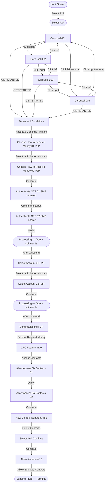

# PayCenter ZTK Demo — Flow Diagram

## Implemented Flow (Enroll P2P)

---

## Implemented Flow (Enroll SMB)

```mermaid
flowchart TD
    LOCK([Lock Screen])
    SMB_RADIO([Select SMB])
    SC001[SMB Carousel 001]
    SC002[SMB Carousel 002]
    SC003[SMB Carousel 003]
    SC004[SMB Carousel 004]
    TERMS[Terms and Conditions]
    SCHR01[Choose How to Receive Money 01 SMB]
    SCHR02[Choose How to Receive Money 02 SMB]
    AUTH03[Authenticate OTP 03 SMB]
    AUTH04[Authenticate OTP 04 SMB]
    OTP01[Authenticate OTP 01 SMB]
    OTP02[Authenticate OTP 02 SMB]
    PROCSMB([Processing — fade + spinner 1s])
    TAG01[Create Zelle Tag 01 SMB]
    TAG02[Create Zelle Tag 02 SMB]
    PROCTAG03([Processing — fade + spinner 1s])
    TAG03[Create Zelle Tag 03 SMB — Not Available]
    TAG04[Create Zelle Tag 04 SMB]
    PROCTAG05([Processing — fade + spinner 1s])
    TAG05[Create Zelle Tag 05 SMB — Available]
    SP01[Select Primary Account 01 SMB]
    SP02[Select Primary Account 02 SMB]
    PROCCONGRATSSMB([Processing — fade + spinner 1s])
    CONGRATSSMB[Congratulations SMB]
    ZRCSMB[ZRC Feature Intro]
    TAGINTRO[Zelle Tag Feature Introduction SMB]
    AC01SHARED[Allow Access To Contacts 01 — shared with P2P]
    LANDINGSMB([Landing Page — Terminal])

    LOCK --> |Select SMB| SMB_RADIO
    SMB_RADIO --> SC001

    SC001 --> |Click right| SC002
    SC002 --> |Click right| SC003
    SC003 --> |Click right| SC004
    SC004 --> |Click right — wrap| SC001

    SC002 --> |Click left| SC001
    SC003 --> |Click left| SC002
    SC004 --> |Click left| SC003
    SC001 --> |Click left — wrap| SC004

    SC001 --> |GET STARTED| TERMS
    SC002 --> |GET STARTED| TERMS
    SC003 --> |GET STARTED| TERMS
    SC004 --> |GET STARTED| TERMS

    TERMS --> |Accept & Continue — SMB context| SCHR01
    SCHR01 --> |Select radio button - instant| SCHR02
    SCHR02 --> |Continue| AUTH03
    AUTH03 --> |Select radio button - instant| AUTH04
    AUTH04 --> |Continue| OTP01
    OTP01 --> |Click leftmost OTP box| OTP02
    OTP02 --> |Verify| PROCSMB
    PROCSMB --> |After 1 second| TAG01
    TAG01 --> |Enter Zelle tag| TAG02
    TAG02 --> |Check Availability| PROCTAG03
    PROCTAG03 --> |After 1 second| TAG03
    TAG03 --> |Select MikesLawnCare suggestion| TAG04
    TAG04 --> |Check Availability| PROCTAG05
    PROCTAG05 --> |After 1 second| TAG05
    TAG05 --> |Save and Continue| SP01
    SP01 --> |Select radio button - instant| SP02
    SP02 --> |Continue| PROCCONGRATSSMB
    PROCCONGRATSSMB --> |After 1 second| CONGRATSSMB
    CONGRATSSMB --> |Send or Request Money| ZRCSMB
    ZRCSMB --> |5s no click| TAGINTRO
    TAGINTRO --> |5s no click| ZRCSMB
    ZRCSMB --> |Access Contacts| AC01SHARED
    TAGINTRO --> |Skip For Now| AC01SHARED
    AC01SHARED --> |shared P2P tail: AC02, How Share, Select and Continue, Allow Access to 15| LANDINGSMB
```

---

*Last updated: 2026-07-31 — Inserted the shared Authenticate OTP 01/02 SMB screens into the Enroll P2P flow, and added fade + spinner (1s) loading state to the Create Zelle Tag 02→03, Create Zelle Tag 04→05, and Select Primary Account 02→Congratulations SMB transitions.*
