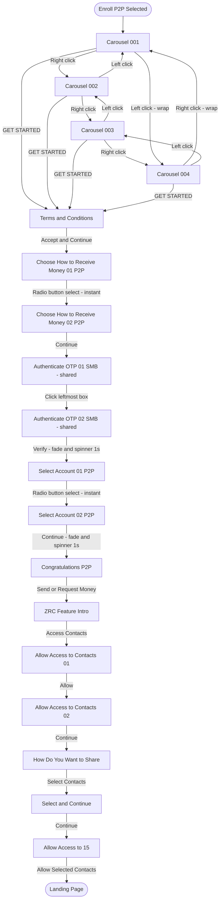
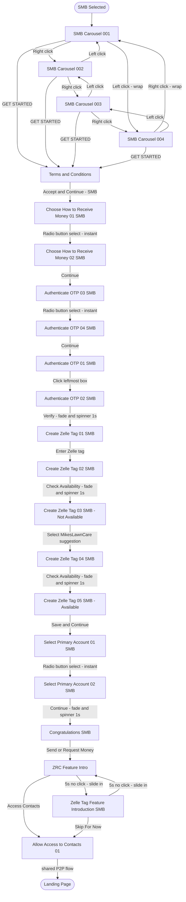

# Feature Specification: PayCenter ZTK Demo — Enroll P2P Flow

**Feature Branch**: `006-ztk-enroll-p2p-demo`
**Created**: 2026-05-20
**Last Updated**: 2026-05-21
**Status**: Active
**Input**: User description: "Build a PayCenter ZTK demo application with mobile phone mockup, JH background, use case radio buttons, complete Enroll P2P screen flow, and partial Enroll SMB flow."

---

## User Scenarios & Testing *(mandatory)*

### User Story 1 — Enroll P2P Complete Flow (Priority: P1)

A demo presenter opens the PayCenter ZTK demo page, selects the "Enroll P2P" radio button, and walks a stakeholder through the full enrollment experience. They navigate the introductory carousel, accept terms and conditions, choose a payment method, select an account, and complete enrollment — ending at the Landing Page.

**Why this priority**: This is the primary deliverable — an interactive, click-through demo of the Enroll P2P product flow used in sales and stakeholder presentations.

**Independent Test**: Open the demo page in a browser, select "Enroll P2P," and advance through all 19 screen transitions to reach Landing Page without errors.

**Acceptance Scenarios**:

1. **Given** the demo page is open and "Enroll P2P" is selected, **When** the presenter views the mobile device, **Then** `Zelle P2P Enrollment Carousel Image 001` is displayed in the device screen.
2. **Given** Carousel Image 001 is displayed, **When** the right half of the device screen is clicked, **Then** Image 001 slides out to the left and Image 002 slides in from the right over 300ms.
3. **Given** Carousel Image 002 is displayed, **When** the left half of the device screen is clicked, **Then** Image 002 slides out to the right and Image 001 slides back in from the left over 300ms.
4. **Given** Carousel Image 004 is displayed, **When** the right half is clicked, **Then** the display wraps to Image 001 with a 300ms slide-left animation.
5. **Given** Carousel Image 001 is displayed, **When** the left half is clicked, **Then** the display wraps to Image 004 with a 300ms slide-right animation.
6. **Given** any carousel image (001–004) is displayed, **When** the GET STARTED call-to-action area is clicked, **Then** the Terms and Conditions screen appears.
7. **Given** Terms and Conditions is displayed, **When** "Accept & Continue" is clicked, **Then** Choose How to Receive Money 01 P2P appears.
8. **Given** Choose How to Receive Money 01 P2P is displayed, **When** either radio button is selected, **Then** Choose How to Receive Money 02 P2P appears immediately with no slide animation.
9. **Given** Choose How to Receive Money 02 P2P is displayed, **When** the Continue CTA is clicked, **Then** Authenticate OTP 01 SMB appears (reusing the shared OTP entry screen).
10. **Given** Authenticate OTP 01 SMB is displayed (P2P context), **When** the leftmost of the six OTP boxes is clicked, **Then** Authenticate OTP 02 SMB appears.
11. **Given** Authenticate OTP 02 SMB is displayed (P2P context), **When** the Verify CTA is clicked, **Then** the screen fades to 50% opacity and a spinning loading indicator appears for 1 second, then Select Account 01 P2P appears.
12. **Given** Select Account 01 P2P is displayed, **When** either radio button is selected, **Then** Select Account 02 P2P appears immediately with no slide animation.
13. **Given** Select Account 02 P2P is displayed, **When** the Continue CTA is clicked, **Then** the screen fades to 50% opacity and a spinning loading indicator appears for 1 second, then Congratulations P2P is displayed.
14. **Given** Congratulations P2P is displayed, **When** "Send or Request Money" is clicked, **Then** ZRC Feature Intro appears.
15. **Given** ZRC Feature Intro is displayed, **When** "Access Contacts" is clicked, **Then** Allow Access to Contacts 01 appears.
16. **Given** Allow Access to Contacts 01 is displayed, **When** "Allow" is clicked, **Then** Allow Access to Contacts 02 appears.
17. **Given** Allow Access to Contacts 02 is displayed, **When** Continue is clicked, **Then** How Do You Want to Share appears.
18. **Given** How Do You Want to Share is displayed, **When** "Select Contacts" is clicked, **Then** Select and Continue appears.
19. **Given** Select and Continue is displayed, **When** Continue is clicked, **Then** Allow Access to 15 appears.
20. **Given** Allow Access to 15 is displayed, **When** "Allow Selected Contacts" is clicked, **Then** Landing Page appears.

---

### User Story 2 — Initial Demo Layout (Priority: P2)

A viewer opens the demo page and immediately sees a professional branded layout: the JH corporate background image fills the page, a mobile device frame appears on the right side, and four use case options with radio buttons are listed to the left of the device.

**Why this priority**: The first impression of the demo establishes credibility. The layout and visual design must be consistent before any interaction begins.

**Independent Test**: Open the demo page and verify the background, mobile device placement, and use case panel are all visible and correctly positioned without selecting any radio button.

**Acceptance Scenarios**:

1. **Given** the demo page is opened, **When** no use case is selected, **Then** the JH background image covers the full page, the mobile device is positioned on the right, and the use case panel is to the left of the device.
2. **Given** the page loads, **When** the viewer reads the use case list, **Then** the two options shown are: P2P, SMB — each with a selectable radio button.
3. **Given** no use case is selected, **When** the device screen is viewed, **Then** the `JH50 Lock Screen` image is displayed in the device screen.

---

### User Story 4 — Enroll SMB Complete Flow (Priority: P1)

A demo presenter opens the PayCenter ZTK demo page, selects the "SMB" radio button, and walks a stakeholder through the full SMB enrollment experience: introductory carousel, terms acceptance, payment method choice, OTP authentication, Zelle tag creation (including a name-availability retry path), primary account selection, congratulations, an alternating feature-introduction pair, and convergence into the shared contacts-permission and sharing flow — ending at the Landing Page.

**Why this priority**: This is the second primary deliverable — an interactive, click-through demo of the Enroll SMB product flow used in sales and stakeholder presentations, of equal priority to Enroll P2P.

**Independent Test**: Open the demo page in a browser, select "SMB," and advance through all transitions to reach Landing Page without errors.

**Acceptance Scenarios**:

1. **Given** the demo page is open and "SMB" is selected, **When** the presenter views the mobile device, **Then** `Zelle SMB Enrollment Carousel Image 001` is displayed in the device screen.
2. **Given** any SMB carousel image (001–004) is displayed, **When** the GET STARTED call-to-action area is clicked, **Then** the Terms and Conditions screen appears.
3. **Given** Terms and Conditions is displayed (SMB context), **When** "Accept & Continue" is clicked, **Then** Choose How to Receive Money 01 SMB appears.
4. **Given** Choose How to Receive Money 01 SMB is displayed, **When** either radio button is selected, **Then** Choose How to Receive Money 02 SMB appears immediately with no slide animation.
5. **Given** Choose How to Receive Money 02 SMB is displayed, **When** the Continue CTA is clicked, **Then** Authenticate OTP 03 SMB appears.
6. **Given** Authenticate OTP 03 SMB is displayed, **When** the radio button is selected, **Then** Authenticate OTP 04 SMB appears immediately with no slide animation.
7. **Given** Authenticate OTP 04 SMB is displayed, **When** the Continue CTA is clicked, **Then** Authenticate OTP 01 SMB appears.
8. **Given** Authenticate OTP 01 SMB is displayed, **When** the leftmost of the six OTP boxes is clicked, **Then** Authenticate OTP 02 SMB appears.
9. **Given** Authenticate OTP 02 SMB is displayed, **When** the Verify CTA is clicked, **Then** the screen fades to 50% opacity and a spinning loading indicator appears for 1 second, then Create Zelle Tag 01 SMB is displayed.
10. **Given** Create Zelle Tag 01 SMB is displayed, **When** the "Enter your Zelle tag" area is clicked, **Then** Create Zelle Tag 02 SMB (Mikes Lawn Care Entered) appears.
11. **Given** Create Zelle Tag 02 SMB is displayed, **When** the Check Availability CTA is clicked, **Then** the screen fades to 50% opacity and a spinning loading indicator appears for 1 second, then Create Zelle Tag 03 SMB (Mikes Lawn Care Not Available) appears.
12. **Given** Create Zelle Tag 03 SMB is displayed, **When** the "MikesLawnCare" suggestion area is clicked, **Then** Create Zelle Tag 04 SMB (Mikes Dog Walking Entered) appears.
13. **Given** Create Zelle Tag 04 SMB is displayed, **When** the Check Availability CTA is clicked, **Then** the screen fades to 50% opacity and a spinning loading indicator appears for 1 second, then Create Zelle Tag 05 SMB (Mikes Dog Walking Available) appears.
14. **Given** Create Zelle Tag 05 SMB is displayed, **When** the Save and Continue CTA is clicked, **Then** Select Primary Account 01 SMB appears.
15. **Given** Select Primary Account 01 SMB is displayed, **When** either radio button is selected, **Then** Select Primary Account 02 SMB appears immediately with no slide animation.
16. **Given** Select Primary Account 02 SMB is displayed, **When** the Continue CTA is clicked, **Then** the screen fades to 50% opacity and a spinning loading indicator appears for 1 second, then Congratulations SMB appears.
17. **Given** Congratulations SMB is displayed, **When** "Send or Request Money" is clicked, **Then** ZRC Feature Intro appears.
18. **Given** ZRC Feature Intro is displayed (SMB context), **When** no click occurs within 5 seconds, **Then** Zelle Tag Feature Introduction SMB slides in from the right; the two screens continue alternating every 5 seconds until the presenter clicks a designated area on either screen.
19. **Given** either ZRC Feature Intro or Zelle Tag Feature Introduction SMB is displayed, **When** "Access Contacts" (on ZRC Feature Intro) or "Skip For Now" (on Zelle Tag Feature Introduction SMB) is clicked, **Then** the flow converges into the shared Allow Access to Contacts 01 screen (identical to P2P step 13 onward) and proceeds through Allow Access to Contacts 02, How Do You Want to Share, Select and Continue, and Allow Access to 15, ending at Landing Page.

---

### User Story 3 — Placeholder Use Cases (Priority: P3) — RETIRED

**Status**: Retired 2026-07-30. Originally covered three non-Enroll-P2P placeholder use cases (Enroll SMB, Send P2P Payment, Send SMB Payment) that reset to Lock Screen without a defined flow. The use-case panel now offers only two options — **P2P** and **SMB** — both of which have complete, fully-specified flows (see User Story 1 and User Story 4). No placeholder use cases remain, so this story and its acceptance scenarios no longer apply.

---

### Edge Cases

- What happens when the user navigates backward from Carousel Image 001 (left click)? → Wrap to Carousel Image 004.
- What happens when the user clicks a screen area that is not an active hotspot? → No navigation occurs; the current screen remains.
- What happens if a screen transition is triggered before the previous animation completes? → The transition should complete gracefully without entering a broken visual state.
- What happens at the Landing Page? → Landing Page is a terminal state; no further navigation is available. The presenter reselects a use-case radio button to restart.
- What happens when the presenter switches use cases mid-flow? → The device screen resets to Lock Screen immediately; all prior flow state is discarded.
- What happens when "P2P" is reselected after reaching Landing Page or mid-flow? → Flow always restarts from Carousel Image 001; no state is preserved.
- What happens when "SMB" is reselected after reaching Landing Page or mid-flow? → Flow always restarts from SMB Carousel Image 001; no state is preserved.
- What happens on the Create Zelle Tag 03 SMB (name unavailable) screen if the presenter does not click the suggested alternate name? → No navigation occurs; the current screen remains (same inactive-hotspot rule as elsewhere).
- What happens if the presenter clicks during the SMB 5-second alternating intro rotation? → The rotation timer is cancelled and the flow proceeds immediately per the clicked screen's designated CTA (Access Contacts or Skip For Now).

## Clarifications

### Session 2026-07-30

- Q: Enroll SMB is fully implemented but undocumented in spec.md. Add it to this spec (006), like P2P is documented? → A: Yes — keep the already-implemented SMB flow, but simplify the use-case panel to just two options (P2P, SMB) instead of four.
- Q: Should the 5-second alternating ZRC/Zelle Tag intro rotation be a formal, testable requirement? → A: Yes — formal measurable FR/SC with tolerance (5s ±0.5s).
- Q: SMB's contacts-sharing tail reuses the same screens as P2P. Document this as a shared/merged flow point? → A: Yes — SMB converges into the existing shared Allow Access to Contacts 01 → Landing Page path (same as P2P steps 12–17).
- Q: To reduce the use-case list to just P2P and SMB, should Send P2P Payment / Send SMB Payment be removed entirely from the panel? → A: Yes — remove both Send options; rename "Enroll P2P" → "P2P" and "Enroll SMB" → "SMB".
- Q: With only P2P and SMB remaining (both fully implemented), should the spec retire User Story 3 / FR-021 (non-P2P placeholder reset)? → A: Yes — retire; no placeholder use cases remain.

### Session 2026-07-27

- Q: What should non-P2P use-case selections display? → A: Always show the Lock Screen image.
- Q: What numeric threshold should define SC-002 perceptible delay? → A: <=250ms after click, excluding intentional animations/loading.
- Q: How should the complete Enroll P2P flow transition count be defined for testing? → A: 17 transitions on the canonical forward path from Carousel 001 to Landing Page.

### Session 2026-05-21

- Q: Should new requirements (lock screen, SMB flow, separate docs) be added to this spec or a new spec? → A: Amend this existing spec in place.
- Q: Should switching use cases reset the device to blank/black or to the Lock Screen image? → A: Lock Screen image — FR-026 and FR-027 updated accordingly.
- Q: Should SMB flow be implemented now or blocked until images are provided? → A: Block SMB implementation until all SMB image files are present in `images/`; document remaining steps as TBD in spec and `screen-flow.md`.
- Q: How should the shared Terms & Conditions screen route correctly to P2P vs SMB after Accept & Continue? → A: Track active use case in `flowState` (e.g. `'terms-p2p'` vs `'terms-smb'`) so Accept & Continue dispatches to the correct next screen.
- Q: Where should screen-flow.md and flow-diagram.md live? → A: In `ZTK Demo Project/` alongside `index.html` — accessible as demo artifacts, not spec-only files.
- Q: Should switching use cases reset the device to blank/black or to the Lock Screen image? → A: Lock Screen image — FR-026 and FR-027 updated accordingly.

### Session 2026-05-20

- Q: Where should the screen flow table and Mermaid diagram appear? → A: Documentation files only — neither appears on the demo HTML page.
- Q: What happens when the user reaches the Landing Page (end state)? → A: Landing Page is a terminal state; the presenter manually reselects a radio button to restart.
- Q: What happens to the device screen when the presenter switches use cases mid-flow? → A: Device screen resets to Lock Screen immediately when any different use case is selected.
- Q: Is the GET STARTED hotspot the same position across all four carousel images? → A: Yes — a single shared hotspot region is used for all four images (button placement is consistent).
- Q: When "Enroll P2P" is reselected, does the flow restart or resume? → A: Always restarts from Carousel Image 001 (full reset, no state preserved).

---

## Screen Flow Reference

Note: The tables below are the full transition maps for each use case. SC-001 uses the P2P canonical forward path of 19 transitions from Carousel 001 to Landing Page; SC-008 uses the SMB canonical forward path of 24 transitions from SMB Carousel 001 to Landing Page. Both flows converge at the shared Allow Access to Contacts 01 screen, and both flows also share the Authenticate OTP 01/02 SMB screens as a common OTP entry step.

### Screen Flow Table — P2P

| Step | Current Screen | Trigger | Next Screen | Transition |
|------|---------------|---------|-------------|------------|
| 1 | Carousel 001 | Click right half | Carousel 002 | Slide left 300ms |
| 2 | Carousel 002 | Click right half | Carousel 003 | Slide left 300ms |
| 3 | Carousel 003 | Click right half | Carousel 004 | Slide left 300ms |
| 4 | Carousel 004 | Click right half | Carousel 001 | Slide left 300ms (wrap) |
| 5 | Carousel 001 | Click left half | Carousel 004 | Slide right 300ms (wrap) |
| 6 | Carousel 002 | Click left half | Carousel 001 | Slide right 300ms |
| 7 | Carousel 003 | Click left half | Carousel 002 | Slide right 300ms |
| 8 | Carousel 004 | Click left half | Carousel 003 | Slide right 300ms |
| 9 | Carousel 001–004 | Click GET STARTED CTA | Terms and Conditions | Instant |
| 10 | Terms and Conditions | Click Accept & Continue | Choose How to Receive Money 01 P2P | Instant |
| 11 | Choose How to Receive Money 01 P2P | Select radio button | Choose How to Receive Money 02 P2P | Instant (no animation) |
| 12 | Choose How to Receive Money 02 P2P | Click Continue CTA | Authenticate OTP 01 SMB *(shared screen)* | Instant |
| 13 | Authenticate OTP 01 SMB (P2P context) | Click leftmost of six OTP boxes | Authenticate OTP 02 SMB | Instant |
| 14 | Authenticate OTP 02 SMB (P2P context) | Click Verify CTA | Select Account 01 P2P | Fade 50% + spinner 1 second |
| 15 | Select Account 01 P2P | Select radio button | Select Account 02 P2P | Instant (no animation) |
| 16 | Select Account 02 P2P | Click Continue CTA | Congratulations P2P | Fade 50% + spinner 1 second |
| 17 | Congratulations P2P | Click Send or Request Money | ZRC Feature Intro | Instant |
| 18 | ZRC Feature Intro | Click Access Contacts CTA | Allow Access to Contacts 01 | Instant |
| 19 | Allow Access to Contacts 01 | Click Allow CTA | Allow Access to Contacts 02 | Instant |
| 20 | Allow Access to Contacts 02 | Click Continue CTA | How Do You Want to Share | Instant |
| 21 | How Do You Want to Share | Click Select Contacts CTA | Select and Continue | Instant |
| 22 | Select and Continue | Click Continue CTA | Allow Access to 15 | Instant |
| 23 | Allow Access to 15 | Click Allow Selected Contacts CTA | Landing Page | Instant |

### Demo Flow — Mermaid Diagram

### Screen Flow Table — SMB

| Step | Current Screen | Trigger | Next Screen | Transition |
|------|---------------|---------|-------------|------------|
| 1 | SMB Carousel 001 | Click right half | SMB Carousel 002 | Slide left 300ms |
| 2 | SMB Carousel 002 | Click right half | SMB Carousel 003 | Slide left 300ms |
| 3 | SMB Carousel 003 | Click right half | SMB Carousel 004 | Slide left 300ms |
| 4 | SMB Carousel 004 | Click right half | SMB Carousel 001 | Slide left 300ms (wrap) |
| 5 | SMB Carousel 001–004 | Click left half | Previous SMB Carousel image | Slide right 300ms (wraps) |
| 6 | SMB Carousel 001–004 | Click GET STARTED CTA | Terms and Conditions | Instant |
| 7 | Terms and Conditions | Click Accept & Continue (SMB context) | Choose How to Receive Money 01 SMB | Instant |
| 8 | Choose How to Receive Money 01 SMB | Select radio button | Choose How to Receive Money 02 SMB | Instant (no animation) |
| 9 | Choose How to Receive Money 02 SMB | Click Continue CTA | Authenticate OTP 03 SMB | Instant |
| 10 | Authenticate OTP 03 SMB | Select radio button | Authenticate OTP 04 SMB | Instant (no animation) |
| 11 | Authenticate OTP 04 SMB | Click Continue CTA | Authenticate OTP 01 SMB | Instant |
| 12 | Authenticate OTP 01 SMB | Click leftmost of six OTP boxes | Authenticate OTP 02 SMB | Instant |
| 13 | Authenticate OTP 02 SMB | Click Verify CTA | Create Zelle Tag 01 SMB | Fade 50% + spinner 1 second |
| 14 | Create Zelle Tag 01 SMB | Click "Enter your Zelle tag" area | Create Zelle Tag 02 SMB (Mikes Lawn Care Entered) | Instant |
| 15 | Create Zelle Tag 02 SMB | Click Check Availability CTA | Create Zelle Tag 03 SMB (Mikes Lawn Care Not Available) | Fade 50% + spinner 1 second |
| 16 | Create Zelle Tag 03 SMB | Click "MikesLawnCare" suggestion | Create Zelle Tag 04 SMB (Mikes Dog Walking Entered) | Instant |
| 17 | Create Zelle Tag 04 SMB | Click Check Availability CTA | Create Zelle Tag 05 SMB (Mikes Dog Walking Available) | Fade 50% + spinner 1 second |
| 18 | Create Zelle Tag 05 SMB | Click Save and Continue CTA | Select Primary Account 01 SMB | Instant |
| 19 | Select Primary Account 01 SMB | Select radio button | Select Primary Account 02 SMB | Instant (no animation) |
| 20 | Select Primary Account 02 SMB | Click Continue CTA | Congratulations SMB | Fade 50% + spinner 1 second |
| 21 | Congratulations SMB | Click Send or Request Money | ZRC Feature Intro | Instant |
| 22 | ZRC Feature Intro | No click for 5 seconds | Zelle Tag Feature Introduction SMB | Slide in from right, 300ms; repeats alternating every 5s until clicked |
| 23 | ZRC Feature Intro | Click Access Contacts CTA | Allow Access to Contacts 01 *(shared with P2P)* | Instant |
| 24 | Zelle Tag Feature Introduction SMB | Click Skip For Now | Allow Access to Contacts 01 *(shared with P2P)* | Instant |

From Allow Access to Contacts 01, the SMB flow continues through the identical shared screens used by P2P (Allow Access to Contacts 02 → How Do You Want to Share → Select and Continue → Allow Access to 15 → Landing Page); see the P2P Screen Flow Table steps for those transitions.

### Demo Flow — Mermaid Diagram (SMB)

---

## Requirements *(mandatory)*

### Functional Requirements

- **FR-001**: The demo MUST display `JHBackground.png` as the full-page background behind all other content.
- **FR-002**: The mobile device mockup MUST be positioned on the right side of the page, with the use-case selection panel visible to its left.
- **FR-003**: The use-case panel MUST display exactly two options with radio buttons: **P2P** and **SMB**. The previously separate "Send P2P Payment" and "Send SMB Payment" placeholder options are removed.
- **FR-004**: Selecting "P2P" MUST always start the P2P flow from Carousel Image 001, discarding any previously saved state; selecting "SMB" MUST always start the SMB flow from SMB Carousel Image 001, discarding any previously saved state.
- **FR-005**: The device screen MUST be divided into a left-click region and a right-click region for carousel navigation.
- **FR-006**: Clicking the right region MUST advance the carousel to the next image with a 300ms slide-left animation; clicking the left region MUST show the previous image with a 300ms slide-right animation.
- **FR-007**: Carousel navigation MUST wrap: advancing past image 004 returns to 001; going back from 001 returns to 004.
- **FR-008**: All four carousel images (001–004) share a single GET STARTED hotspot region at a consistent relative position within the device screen; clicking anywhere within that region on any carousel image MUST navigate to Terms and Conditions.
- **FR-009**: Terms and Conditions MUST define an "Accept & Continue" clickable area; clicking it MUST navigate to Choose How to Receive Money 01 P2P.
- **FR-010**: Choose How to Receive Money 01 P2P MUST respond to a radio button selection by immediately showing Choose How to Receive Money 02 P2P with no transition animation.
- **FR-011**: Choose How to Receive Money 02 P2P MUST define a Continue clickable area; clicking it MUST navigate to Authenticate OTP 01 SMB (the same shared OTP entry screen used by the SMB flow).
- **FR-050**: Authenticate OTP 01 SMB, when reached from the P2P flow, MUST define a clickable area on the leftmost of the six OTP entry boxes (shared with FR-033); clicking it MUST navigate to Authenticate OTP 02 SMB.
- **FR-051**: Authenticate OTP 02 SMB, when reached from the P2P flow, MUST define a Verify clickable area (shared with FR-034); clicking it MUST fade the current screen to 50% opacity, display a visible spinning loading indicator for 1 second, then show Select Account 01 P2P.
- **FR-012**: Select Account 01 P2P MUST respond to a radio button selection by immediately showing Select Account 02 P2P with no transition animation.
- **FR-013**: Select Account 02 P2P MUST define a Continue clickable area; clicking it MUST fade the current screen to 50% opacity, display a visible spinning loading indicator for 1 second, then show Congratulations P2P.
- **FR-014**: Congratulations P2P MUST define a "Send or Request Money" clickable area; clicking it MUST navigate to ZRC Feature Intro.
- **FR-015**: ZRC Feature Intro MUST define an "Access Contacts" clickable area; clicking it MUST navigate to Allow Access to Contacts 01.
- **FR-016**: Allow Access to Contacts 01 MUST define an "Allow" clickable area; clicking it MUST navigate to Allow Access to Contacts 02.
- **FR-017**: Allow Access to Contacts 02 MUST define a Continue clickable area; clicking it MUST navigate to How Do You Want to Share.
- **FR-018**: How Do You Want to Share MUST define a "Select Contacts" clickable area; clicking it MUST navigate to Select and Continue.
- **FR-019**: Select and Continue MUST define a Continue clickable area; clicking it MUST navigate to Allow Access to 15.
- **FR-020**: Allow Access to 15 MUST define an "Allow Selected Contacts" clickable area; clicking it MUST navigate to Landing Page.
- **FR-021**: *(Retired 2026-07-30 — no placeholder use cases remain; both P2P and SMB have complete flows. See User Story 3 status.)*
- **FR-022**: Default CTA animation MUST be instant (no slide) unless the requirement specifies otherwise; carousel navigation animations MUST be 300ms.
- **FR-028**: Selecting "SMB" MUST populate the device screen with `Zelle SMB Enrollment Carousel Image 001.png` and support the same left/right click regions, 300ms slide animation, and 001–004 wrap-around behavior as the P2P carousel (FR-005 through FR-007).
- **FR-029**: All four SMB carousel images (001–004) share a single GET STARTED hotspot region; clicking it MUST navigate to Terms and Conditions, tracking the active use case (e.g. `flowState` `'terms-smb'`) so Accept & Continue routes correctly.
- **FR-030**: Terms and Conditions MUST route to Choose How to Receive Money 01 SMB when Accept & Continue is clicked in the SMB context.
- **FR-031**: Choose How to Receive Money 01 SMB MUST respond to a radio button selection by immediately showing Choose How to Receive Money 02 SMB with no transition animation.
- **FR-032**: Choose How to Receive Money 02 SMB MUST define a Continue clickable area; clicking it MUST navigate to Authenticate OTP 03 SMB.
- **FR-046**: Authenticate OTP 03 SMB MUST respond to a radio button selection by immediately showing Authenticate OTP 04 SMB with no transition animation.
- **FR-047**: Authenticate OTP 04 SMB MUST define a Continue clickable area; clicking it MUST navigate to Authenticate OTP 01 SMB.
- **FR-033**: Authenticate OTP 01 SMB MUST define a clickable area on the leftmost of the six OTP entry boxes; clicking it MUST navigate to Authenticate OTP 02 SMB.
- **FR-034**: Authenticate OTP 02 SMB MUST define a Verify clickable area; clicking it MUST fade the current screen to 50% opacity, display a visible spinning loading indicator for 1 second, then show Create Zelle Tag 01 SMB.
- **FR-035**: Create Zelle Tag 01 SMB MUST define an "Enter your Zelle tag" clickable area; clicking it MUST navigate to Create Zelle Tag 02 SMB (Mikes Lawn Care Entered).
- **FR-036**: Create Zelle Tag 02 SMB MUST define a Check Availability clickable area; clicking it MUST fade the current screen to 50% opacity, display a visible spinning loading indicator for 1 second, then show Create Zelle Tag 03 SMB (Mikes Lawn Care Not Available).
- **FR-037**: Create Zelle Tag 03 SMB MUST define a clickable area on the "MikesLawnCare" suggested-name text; clicking it MUST navigate to Create Zelle Tag 04 SMB (Mikes Dog Walking Entered).
- **FR-038**: Create Zelle Tag 04 SMB MUST define a Check Availability clickable area; clicking it MUST fade the current screen to 50% opacity, display a visible spinning loading indicator for 1 second, then show Create Zelle Tag 05 SMB (Mikes Dog Walking Available).
- **FR-039**: Create Zelle Tag 05 SMB MUST define a Save and Continue clickable area; clicking it MUST navigate to Select Primary Account 01 SMB.
- **FR-040**: Select Primary Account 01 SMB MUST respond to a radio button selection by immediately showing Select Primary Account 02 SMB with no transition animation.
- **FR-041**: Select Primary Account 02 SMB MUST define a Continue clickable area; clicking it MUST fade the current screen to 50% opacity, display a visible spinning loading indicator for 1 second, then show Congratulations SMB.
- **FR-023**: The screen flow tables and Mermaid diagrams MUST be maintained in `ZTK Demo Project/screen-flow.md` and `ZTK Demo Project/flow-diagram.md`, and they MUST NOT appear on the demo HTML page.
- **FR-024**: The demo HTML page MUST contain only the interactive demo content — background, device frame, use-case panel, and screen display area.
- **FR-025**: The Landing Page screen is a terminal state; once displayed, no further screen navigation occurs until the presenter selects a use-case radio button.
- **FR-026**: When the presenter selects a different use-case radio button while any screen is displayed, the device screen MUST immediately reset to the Lock Screen state and all prior flow state MUST be discarded.
- **FR-027**: The default device screen state (on page load and on use-case reset) MUST display `JH50 Lock Screen.png`.
- **FR-042**: Congratulations SMB MUST define a "Send or Request Money" clickable area; clicking it MUST navigate to ZRC Feature Intro (SMB context).
- **FR-043**: When ZRC Feature Intro (SMB context) has been displayed for 5 seconds without a qualifying click, it MUST slide out and Zelle Tag Feature Introduction SMB MUST slide in from the right; if that screen is likewise not clicked within 5 seconds, ZRC Feature Intro MUST slide back in. This alternation MUST repeat indefinitely until the presenter clicks a designated area on either screen.
- **FR-044**: Clicking "Access Contacts" on ZRC Feature Intro (SMB context) or "Skip For Now" on Zelle Tag Feature Introduction SMB MUST cancel the alternating rotation and navigate to the shared Allow Access to Contacts 01 screen.
- **FR-045**: From Allow Access to Contacts 01 onward, the SMB flow MUST reuse the identical shared screens and hotspots already defined for P2P (FR-016 through FR-020: Allow Access to Contacts 02 → How Do You Want to Share → Select and Continue → Allow Access to 15 → Landing Page).

### Image Assets

The following image files from the `images/` folder MUST be used as specified:

| Image File | Role in Demo |
|---|---|
| `JHBackground.png` | Full-page background |
| `JH50 Lock Screen.png` | Default device screen state (page load and use-case reset) |
| `Zelle P2P Enrollment Carousel Image 001.png` | Enrollment intro carousel — slide 1 |
| `Zelle P2P Enrollment Carousel Image 002.png` | Enrollment intro carousel — slide 2 |
| `Zelle P2P Enrollment Carousel Image 003.png` | Enrollment intro carousel — slide 3 |
| `Zelle P2P Enrollment Carousel Image 004.png` | Enrollment intro carousel — slide 4 |
| `Terms and Conditions.png` | T&C acceptance screen |
| `Choose How to Receive Money 01 P2P.png` | Payment method selection — step 1 |
| `Choose How to Receive Money 02 P2P.png` | Payment method confirmation — step 2 |
| `Select Account 01 P2P.png` | Account selection — step 1 |
| `Select Account 02 P2P.png` | Account selection — step 2 |
| `Congratulations P2P.png` | Enrollment success confirmation |
| `ZRC Feature Intro.png` | Zelle Request Contacts feature introduction |
| `Allow Access To Contacts 01.png` | Contacts permission prompt — step 1 |
| `Allow Access To Contacts 02.png` | Contacts permission prompt — step 2 |
| `How Do You Want to Share.png` | Contact sharing method selection |
| `Select And Continue.png` | Contact selection confirmation |
| `Allow Access to 15.png` | Allow 15 contacts access |
| `Landing Page.png` | Final post-enrollment landing page |
| `Zelle SMB Enrollment Carousel Image 001.png` | SMB enrollment intro carousel — slide 1 |
| `Zelle SMB Enrollment Carousel Image 002.png` | SMB enrollment intro carousel — slide 2 |
| `Zelle SMB Enrollment Carousel Image 003.png` | SMB enrollment intro carousel — slide 3 |
| `Zelle SMB Enrollment Carousel Image 004.png` | SMB enrollment intro carousel — slide 4 |
| `Choose How to Receive Money 01 SMB.png` | SMB payment method selection — step 1 |
| `Choose How to Receive Money 02 SMB.png` | SMB payment method confirmation — step 2 |
| `Authenticate OTP 03 SMB.png` | OTP re-authentication choice — step 1 |
| `Authenticate OTP 04 SMB.png` | OTP re-authentication choice — step 2 |
| `Authenticate OTP 01 SMB.png` | OTP entry — step 1 |
| `Authenticate OTP 02 SMB.png` | OTP entry — step 2 |
| `Create Zelle Tag 01 SMB.png` | Zelle tag creation — entry |
| `Create Zelle Tag 02 SMB - Mikes Lawn Care Entered.png` | Zelle tag creation — name entered |
| `Create Zelle Tag 03 SMB - Mikes Lawn Care Not Available.png` | Zelle tag creation — name unavailable |
| `Create Zelle Tag 04 SMB - Mikes Dog Walking Entered.png` | Zelle tag creation — alternate name entered |
| `Create Zelle Tag 05 SMB - Mikes Dog Walking Available.png` | Zelle tag creation — name available |
| `Select Primary Account 01 SMB.png` | Primary account selection — step 1 |
| `Select Primary Account 02 SMB.png` | Primary account selection — step 2 |
| `Congratulations SMB.png` | SMB enrollment success confirmation |
| `ZRC Intro SMB.png` | ZRC feature introduction (SMB context) |
| `Zelle Tag Feature Introduction SMB.png` | Zelle Tag feature introduction (alternates with ZRC Intro SMB) |

### Key Entities

- **Demo Application**: The single-page interactive demo; owns layout, background, and device frame presentation.
- **Use Case**: One of two selectable demo scenarios (P2P, SMB); determines which screen flow is active.
- **Device Screen**: The display area within the mobile device mockup where screen images are shown.
- **Screen**: An individual image displayed in the device screen at a given point in the flow.
- **Hotspot**: A defined clickable area on a screen image that triggers navigation to the next screen.
- **Carousel**: The sequence of four intro screens (001–004) with left/right navigation and wrap-around behavior.

## Success Criteria *(mandatory)*

### Measurable Outcomes

- **SC-001**: A demo presenter can navigate the complete Enroll P2P flow from Carousel 001 through all 19 transitions on the canonical forward path to Landing Page without any errors or interrupted states.
- **SC-002**: All non-loading, non-carousel-animated screen transitions begin within 250ms of user interaction, excluding intentional animation durations and the 1-second loading state.
- **SC-003**: All carousel slide animations complete in 300ms (±50ms tolerance).
- **SC-004**: The loading state (fade to 50% opacity + spinning indicator) is visible for 1 second before the next screen appears on each of the following transitions: Authenticate OTP 02 SMB → Select Account 01 P2P (P2P context); Select Account 02 P2P → Congratulations P2P; Authenticate OTP 02 SMB → Create Zelle Tag 01 SMB (SMB context); Create Zelle Tag 02 SMB → Create Zelle Tag 03 SMB; Create Zelle Tag 04 SMB → Create Zelle Tag 05 SMB; Select Primary Account 02 SMB → Congratulations SMB.
- **SC-005**: All 39 required image assets for this release (`JHBackground.png` plus 18 P2P device-screen assets plus 20 SMB device-screen assets) load and render correctly, with no broken images or overflow artifacts.
- **SC-006**: The demo runs in a standard desktop browser with no installation, plugins, or network connectivity required.
- **SC-007**: The page layout correctly positions the mobile device on the right and the use-case panel to its left against the JH background, at any standard desktop resolution.
- **SC-008**: A demo presenter can navigate the complete Enroll SMB flow from SMB Carousel 001 through all 24 transitions on the canonical forward path to Landing Page (via the shared Allow Access to Contacts 01 convergence) without any errors or interrupted states.
- **SC-009**: The alternating ZRC Feature Intro / Zelle Tag Feature Introduction SMB rotation triggers every 5 seconds (±0.5s tolerance) when no qualifying click occurs, and stops immediately once either screen's designated area is clicked.

## Assumptions

- The demo does not require a server, database, or network connection to operate; all assets are available locally.
- Each screen image has defined click target areas for its CTA buttons; exact region boundaries are determined during planning.
- The target environment is a desktop browser during a presentation; mobile browser support is out of scope for this version.
- Both P2P and SMB use cases are fully specified in this release; no placeholder use cases remain.
- Reverse wrap-around on left-click from Carousel Image 001 (P2P) or SMB Carousel Image 001 (SMB) displays image 004 of the respective carousel.
- All image files listed in the Image Assets table are present in the `ZTK Demo Project/images/` folder.
- The "Send or Request Money" CTA refers to a single tappable region visible on the Congratulations P2P image (step 15 of the P2P flow) and on the Congratulations SMB image (step 19 of the SMB flow).
